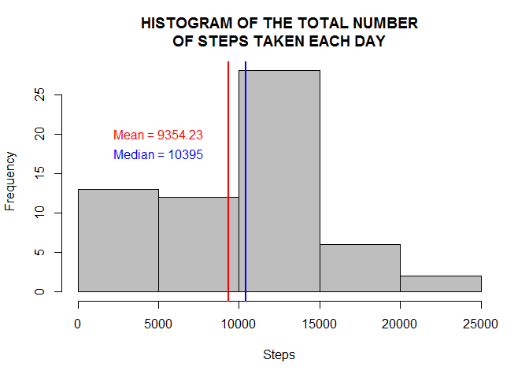
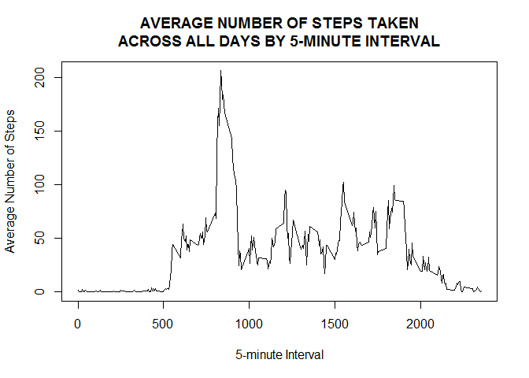
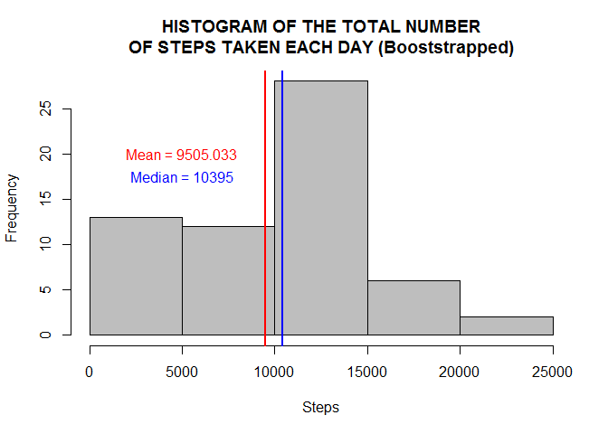
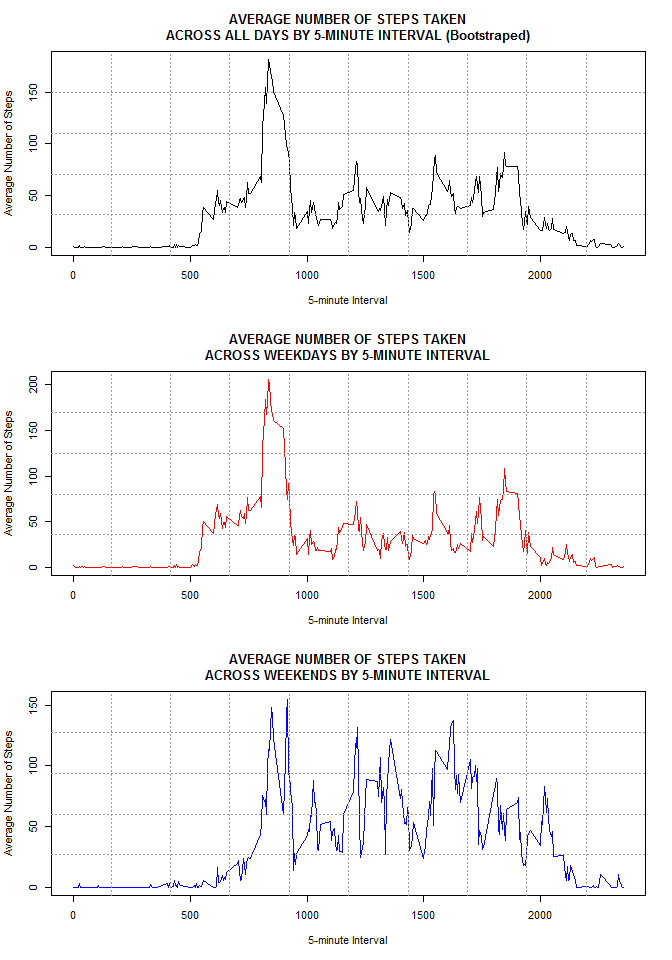

# Peer Assessment 1: Activity Monitoring data
Gilma Hernández  
It is now possible to collect a large amount of data about personal
movement using activity monitoring devices such as a
[Fitbit](http://www.fitbit.com), [Nike Fuelband](http://www.nike.com/us/en_us/c/nikeplus-fuelband), or
[Jawbone Up](https://jawbone.com/up). These type of devices are part of
the "quantified self" movement -- a group of enthusiasts who take
measurements about themselves regularly to improve their health, to
find patterns in their behavior, or because they are tech geeks. But
these data remain under-utilized both because the raw data are hard to
obtain and there is a lack of statistical methods and software for
processing and interpreting the data.

This assignment makes use of data from a personal activity monitoring
device. This device collects data at 5 minute intervals through out the
day. The data consists of two months of data from an anonymous
individual collected during the months of October and November, 2012
and include the number of steps taken in 5 minute intervals each day.

### Data

The data for this assignment can be downloaded from the course web
site:

* Dataset: [Activity monitoring data](https://d396qusza40orc.cloudfront.net/repdata%2Fdata%2Factivity.zip) [52K]

The variables included in this dataset are:

* **steps**: Number of steps taking in a 5-minute interval (missing
    values are coded as `NA`)

* **date**: The date on which the measurement was taken in YYYY-MM-DD
    format

* **interval**: Identifier for the 5-minute interval in which
    measurement was taken

The dataset is stored in a comma-separated-value (CSV) file and there
are a total of 17,568 observations in this
dataset.


### Loading and preprocessing the data
Before read .csv file, we need change the work directory with the <code>setwd()</code> function. Then
we can read the <b>activity.csv</b> file with the following lines:


```r
#1. Load the data
data<-read.csv("activity.csv",header=T,sep=',')

#2. Process/transform the data (if necessary) into a format suitable for your analysis
data[,2]<-as.Date(data$date)
colnames(data)<-c('Steps','Date','Interval')
attach(data)
```


### What is mean total number of steps taken per day?
For this part of the assignment, we ignore the missing values in the dataset. To calculate the total number of steps taken per day, we need the next code:

```r
TotalSteps<-tapply(Steps,Date,sum,na.rm=T)
```

To explore the total steps, we need to make a histogram of the total number of <code>TotalSteps</code>.

```r
hist(TotalSteps,col='grey',xlab='Steps',
   main="HISTOGRAM OF THE TOTAL NUMBER\nOF STEPS TAKEN EACH DAY")
abline(v=c(mean(TotalSteps),median(TotalSteps)),col=c(2,4),lwd=2)
text(5000,c(20,17.5),c('Mean = 9354.23','Median = 10395'),col=c(2,4))
```

 

The mean and median of the total number of steps taken per day are:

```r
mean(TotalSteps)
```

```
## [1] 9354.23
```

```r
median(TotalSteps)
```

```
## [1] 10395
```


### What is the average daily activity pattern?
To calculate the average number of steps taken by the 5-minute interval, we need this command

```r
AverageSteps<-tapply(Steps,Interval,mean,na.rm=T)
FiveMinInt<-as.numeric(names(AverageSteps))
```

The next code make a time series plot of the 5-minute interval and the average number of steps taken, averaged across all days

```r
plot(FiveMinInt,AverageSteps,type='l',
main='AVERAGE NUMBER OF STEPS TAKEN\nACROSS ALL DAYS BY 5-MINUTE INTERVAL',
ylab='Average Number of Steps', xlab='5-minute Interval')
```

 

Which 5-minute interval, on average across all the days in the dataset, contains the maximum number of steps?

```r
names(AverageSteps[which(AverageSteps==max(AverageSteps))])
```

```
## [1] "835"
```


### Imputing missing values
Note that there are a number of days/intervals where there are missing values (coded as NA).
The presence of missing days may introduce bias into some calculations or summaries of the data.

The total number of rows with missing values in the dataset is

```r
table(is.na(Steps))
```

```
## 
## FALSE  TRUE 
## 15264  2304
```

If we explore deep the Steps of the dataset each 5-minute interval, the data is like a Zero-Inflated Poisson distribution, on the other hand the difference between the means and medians of the Steps given the interval, in the cases when was not zero, is huge. We can suppose a Poisson distribution for the Steps given the interval, use the median to generate random values of Poisson distribution for filling in all of the missing values in the dataset.

```r
DataBoost<-function(Data)
{
   set.seed(999)
   Medians<-tapply(Data[,1],Data[,3],median,na.rm=T);   
   interval<-as.numeric(names(Medians));
   for(i in 1:length(interval))
   {
      for(j in 1:length(Data[,1]))
      {
         if(is.na(Data[j,1])==T && Data[j,3]==interval[i])
         {
            Data[j,1]<-sample(rpois(1000,Medians[i]),1);
         }
      }
   }
   Data;
}
```

With the last function we can create a new dataset that is equal to the original dataset but with the missing data filled in.

```r
DataComplete<-DataBoost(data)

#Compare
head(data)
```

```
##   Steps       Date Interval
## 1    NA 2012-10-01        0
## 2    NA 2012-10-01        5
## 3    NA 2012-10-01       10
## 4    NA 2012-10-01       15
## 5    NA 2012-10-01       20
## 6    NA 2012-10-01       25
```

```r
head(DataComplete)
```

```
##   Steps       Date Interval
## 1     0 2012-10-01        0
## 2     0 2012-10-01        5
## 3     0 2012-10-01       10
## 4     0 2012-10-01       15
## 5     0 2012-10-01       20
## 6     0 2012-10-01       25
```

```r
detach(data)
attach(DataComplete) #To use the new dataset
```

Let's make a histogram of the total number of steps taken each day and calculate the mean and median total number of steps taken per day. 

```r
TotalBootsSteps<-tapply(Steps,Date,sum)
mean(TotalBootsSteps)
```

```
## [1] 9505.033
```

```r
median(TotalBootsSteps)
```

```
## [1] 10395
```

```r
hist(TotalBootsSteps,col='grey',xlab='Steps',
  main="HISTOGRAM OF THE TOTAL NUMBER\nOF STEPS TAKEN EACH DAY (Booststrapped)")
abline(v=c(mean(TotalBootsSteps),median(TotalBootsSteps)),
       col=c(2,4),lwd=2)
text(5000,c(20,17.5),c('Mean = 9505.033','Median = 10395'),col=c(2,4))
```

 

These values differ from the estimates from the first part of the assignment in 1.59% for the mean, and 0% for the median. The last result shows the impact of imputing missing data on the estimates of the total daily number of steps and it indicates that this method is feasible to replace the missing data.

## Are there differences in activity patterns between weekdays and weekends?
We use the dataset with the filled-in missing values for this part. First, we need to create a new factor variable in the dataset with two levels <code>weekday</code> and <code>weekend</code> indicating whether a given date is a weekday or weekend day.

```r
days<-strftime(Date,"%u")
DataComplete$WeekDay<-ifelse(days=="6" | days=="7",1,0)
DataComplete$WeekDay<-as.factor(DataComplete$WeekDay)
levels(DataComplete$WeekDay)<-c('weekday','weekend')
```

Let's see a panel plot containing a time series plot of the 5-minute interval and the average number of steps taken, averaged across all weekday days and weekend days.

```r
Weekday<-subset(DataComplete,WeekDay=='weekday')
Weekend<-subset(DataComplete,WeekDay=='weekend')

AverageBootsSteps<-tapply(Steps,Interval,mean)
FiveMinIntTotal<-as.numeric(names(AverageBootsSteps))

AverageWeekendSteps<-tapply(Weekend[,1],Weekend[,3],mean)
AverageWeekdaySteps<-tapply(Weekday[,1],Weekday[,3],mean)

par(mfrow=c(3,1))
plot(FiveMinIntTotal,AverageBootsSteps,type='l',
  main='AVERAGE NUMBER OF STEPS TAKEN\nACROSS ALL DAYS BY 5-MINUTE INTERVAL (Bootstraped)',
  ylab='Average Number of Steps', xlab='5-minute Interval')
grid(10,5,lwd=1,col='gray60')
   
plot(FiveMinIntTotal,AverageWeekdaySteps,type='l',col=2,
  main='AVERAGE NUMBER OF STEPS TAKEN\nACROSS WEEKDAYS BY 5-MINUTE INTERVAL',
  ylab='Average Number of Steps', xlab='5-minute Interval')
grid(10,5,lwd=1,col='gray60')
   
plot(FiveMinIntTotal,AverageWeekendSteps,type='l',col=4,
  main='AVERAGE NUMBER OF STEPS TAKEN\nACROSS WEEKENDS BY 5-MINUTE INTERVAL',
  ylab='Average Number of Steps', xlab='5-minute Interval')
grid(10,5,lwd=1,col='gray60')
```

 
